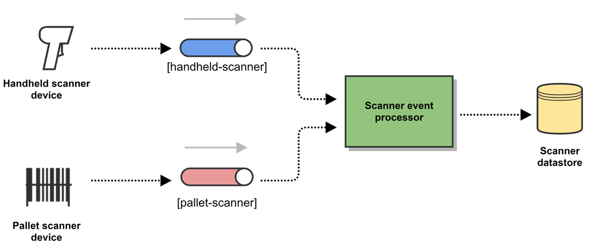

## Hello #FutureShaper
I am glad that you passed the first stages of the interview process 🎉🥳. Now is the time to show us what you got! 

## The objective: 
Generate real-time data pipeline using .NET C#, Kafka and SQL Server.

## System requirements:

- Docker Desktop (supporting Linux containers)
- docker-compose
- Visual Studio 2019 Community Edition or above
- .NET Core 3.1 or above

## Problem description:
Your team is in charge of processing scanned products in a warehouse. You are given the events of two devices: *handheld scanner* and *pallet scanner*. Your assignment consist of creating a data processing pipeline that reads the data from both Kakfa topics and sinks into a single relational SQL database.




## Considerations
* You should develop the **Scanner event processor** in .NET C#.
* You may use the SQL database you prefer.
* **You are given two Kafka topics**: *handheld-scanner* and *pallet-scanner*. See how to start this environment below.
* Each topic has its own format:
  - handheld-scanner: JSON formatted string.
    ```json
    {
      "product_id": "P-10",
      "timestamp": "2023-03-30T16:56:34.524209700Z",
      "scanner_id": "SC-1453"
    }
    ```
  - pallet-scanner: Pipe formatted string.
    ```
      |P-7|1272|2023-03-30T17:11:39.217821400Z|
    ```
* There is a high chance of having more formats from more devices in the future.

**To start the scanner producers environment**, execute the docker-compose file found inside this project. This file includes everything necessary to setup a simple Kafka cluster and the Kafka scanner producers.
```shell 
docker-compose up -d
```

To verify that both topics are being populated, run:
```shell 
# Consume and print handheld-scanner messages

docker run -it --rm --network dotnet-challenge -e KAFKA_BROKER_ID=1 -e KAFKA_ZOOKEEPER_CONNECT=zookeeper=2181 -e KAFKA_TOPIC=handheld-scanner \
confluentinc/cp-kafka:latest sh -c 'kafka-console-consumer --topic $KAFKA_TOPIC --from-beginning --bootstrap-server kafka1:19092'

# Consume and print pallet-scanner messages

docker run -it --rm --network dotnet-challenge -e KAFKA_BROKER_ID=1 -e KAFKA_ZOOKEEPER_CONNECT=zookeeper=2181 -e KAFKA_TOPIC=pallet-scanner \
confluentinc/cp-kafka:latest sh -c 'kafka-console-consumer --topic $KAFKA_TOPIC --from-beginning --bootstrap-server kafka1:19092'
```


## How to submit your answer
- Create a fork with the next format
  -	NameLastnameRole, Ie: JhonSmithSrAdv 
-	Commit as much as you want, remember to show good practices. 
-	Once you got the final commit, push it with title ***Final Commit*** and request a PR
- Try to code as clean as possible. Think of it as if you were tasked in real life.

Good Luck!